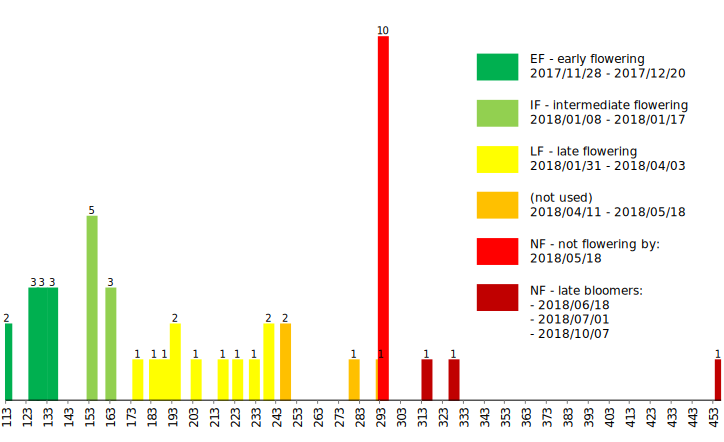

### Plant material, crossing, and genotyping

The homozygous doubled haploid _B. oleracea_ kale-like type TO1000DH3 [@Parkin:2014; hereafter named TO1000] was 
crossed with the giant woody walking stick kale native to Jersey (Channel Islands, UK) from seeds ordered from Mr. and 
Mrs. Johnson, who own a company making artisanal walking sticks ([Homestill](http://homestill.co.uk/cabbage.html), La 
Grande Route de St. Jean, St. Helier, Jersey, Channel Islands). TO1000 is selected for its rapid flowering time and 
short generation time (approx. 65 days), while the Jersey kale is extremely late flowering, has a much longer generation 
time (at least six months), and requires a vernalization period. The two parents were crossed reciprocally, resulting in 
F1 seeds from both parents; 42 F1 genotypes were established in tissue culture and potted in soil.

### Phenotyping on flowering time, bulk assignment

_Figure 1. Days until flowering in the F1, with bulks used in subsequent analyses._

After transferring the 42 F1s from tissue-culture into soil, we found a 420-day time lag (Fig. 1) between the earliest 
and the latest flowering F1 genotypes owing to the heterozygosity of the Jersey kale parent: the first two F1 genotypes 
(genotype numbers 17135, 17136) started to flower 113 days after potting, while more than a year later, at day 533, the 
last F1 flowered (genotype number 17109). The first bulk (early flowering, **EF**) comprised 11 F1 genotypes that 
flowered between 113-135 days after potting. The second bulk included eight F1s that flowered from 154-164 days after 
potting (intermediate flowering, **IF**). The third bulk (late flowering, **LF**) represented 11 F1 genotypes that 
started to flowering from 176-239 days after potting, and the fourth bulk (non flowering at the time of DNA extraction) 
included 9 F1s that only flowered after DNA extraction (up to 533 days after potting) (Fig. 1).