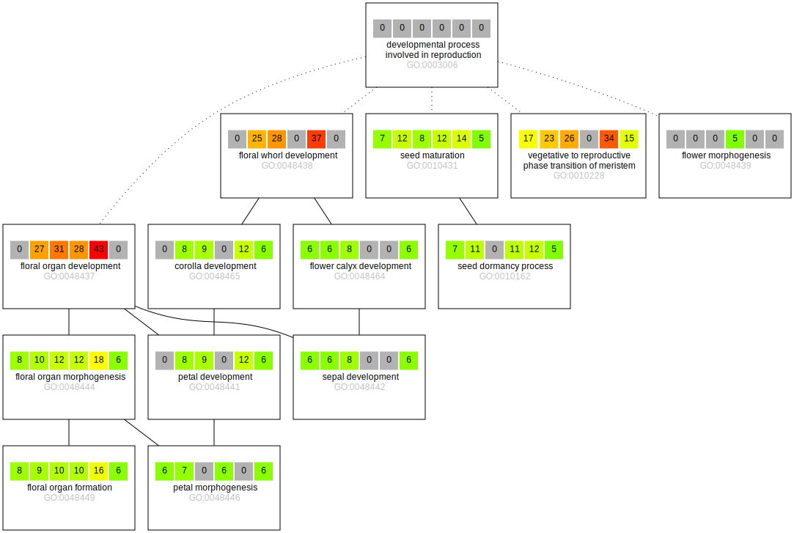

### Functional enrichment and refinement

We performed singular enrichment analyses [SEA; @Huang:2009] separately for all six contrasts using the agriGO web 
service [@Du:2010]. We then merged these results in a cross comparison [SEACOMPARE; @Du:2010], which showed enrichment 
in numerous terms related to reproduction across all contrasts. For each of these result sets, we then retained only 
significantly enriched (FDR<0.05) reproductive developmental processes, i.e. subclasses of the upper level term 
_developmental process involved in reproduction_ (GO:0003006) from the domain _biological process_ of the Gene Ontology 
[@Ashburner:2000].

> #### Supplementary info
> *SEA*  
> To interpret the results of The job identifiers that were assigned to the six contrasts by agriGO are as follows:
> - EF-IF: 383155352 
> - EF-LF: 283547849
> - EF-NF: 847435652
> - IF-LF: 322714491
> - IF-NF: 933274933
> - LF-NF: 577207982
>
> To assess whether terms returned by AgriGO are children of GO:0003006, we traversed the GO using the data release
> of 2018-09-13 (downloaded from http://snapshot.geneontology.org/ontology/go-basic.obo in OBO format version 1.2).
> We did this using [go_filter.pl](../script/go_filter.pl), which uses GO::TermFinder [@Boyle:2004].
>
