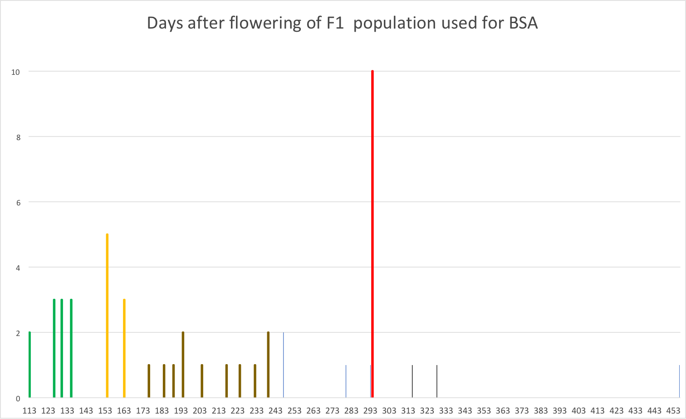

Methods
=======

From a cross between the putatively homozygous _B. oleracea_ var TO1000 and the _B. oleracea_ var Jersey Kale we 
[phenotyped F1 offspring individuals on flowering time](https://github.com/naturalis/brassica-snps/blob/master/README.md).
Of each flowering category (EF, IF, LF, NF) we selected ±10 individuals for bulk segregant analysis, i.e. their isolated DNA
was pooled per category in equal concentrations for each individual and then sequenced using paired-end Illumina sequencing.

We [mapped](https://github.com/naturalis/brassica-snps/blob/master/script/bwa.sh) the reads from each category against
the TO1000 reference genome v2.1 using `BWA mem`. We [computed all variants for all sites](https://github.com/naturalis/brassica-snps/blob/master/script/snp.sh)
over each of these mapped genomes and then performed [joint genotyping](https://github.com/naturalis/brassica-snps/blob/master/script/genotype.sh)
over each combined pair of phenotypic contrasts from among EF-IF, EF-LF, EF-NF, IF-LF, IF-NF, and LF-NF.

We then [transformed](https://github.com/naturalis/brassica-snps/blob/master/script/qtlseqr.sh) these VCF variant files 
(each containing two bulk samples) into tab-separated tables for input into [QTLSeqr](https://github.com/naturalis/brassica-snps/blob/master/script/QTLseqr.R).
This analysis yielded summary information on identified QTL regions (
[1](https://github.com/naturalis/brassica-snps/blob/master/results/EF-IF/gprime.png),
[2](https://github.com/naturalis/brassica-snps/blob/master/results/EF-LF/gprime.png),
[3](https://github.com/naturalis/brassica-snps/blob/master/results/EF-NF/gprime.png),
[4](https://github.com/naturalis/brassica-snps/blob/master/results/IF-LF/gprime.png),
[5](https://github.com/naturalis/brassica-snps/blob/master/results/IF-NF/gprime.png),
[6](https://github.com/naturalis/brassica-snps/blob/master/results/LF-NF/gprime.png)
), as well as calculated G' values for each SNP.

We [created](https://github.com/naturalis/brassica-snps/blob/master/sql/snps.sql) a relational database, into which we
imported data tables for chromosomes (names, centromere locations), genomic features (i.e. locations of genes, 3'/5' UTRs,
exons, CDSs, from the TO1000 reference genome annotation), linkage maps (markers, fwd/rev primer sequences, locations in cM)
and SNPs (locations, ref/alt allele, numerous summary statistics including G' values). From the database schema we then
[generated](https://github.com/naturalis/brassica-snps/blob/master/sql/make_dbix_api.sh) an API that provides
[object-relational mapping](https://github.com/naturalis/brassica-snps/tree/master/lib/My) such that downstream analysis
scripts have simplified access to the integrated data.

For each contrast, we then [queried](https://github.com/naturalis/brassica-snps/blob/master/script/genes_in_qtl_regions.pl)
which genes intersect with the inferred QTL regions, creating a [list](https://github.com/naturalis/brassica-snps/blob/master/results/genes.txt)
of _B. oleracea_ gene IDs sorted by the number of contrasts in which they appear in a QTL region. For each of these genes,
we then [calculated](https://github.com/naturalis/brassica-snps/blob/master/script/snps_in_cds.pl) whether they contained
non-synonymous [SNPs in their coding regions](https://raw.githubusercontent.com/naturalis/brassica-snps/master/results/snps.tsv).

Then, for each contrast, we extracted the gene identifiers that contain nonsynonymous SNPs and 
[translated](https://github.com/naturalis/brassica-snps/blob/master/script/biomart.pl) these gene IDs to UniProtKB 
identifiers (
[1](https://github.com/naturalis/brassica-snps/blob/master/results/EF-IF/uniprot.txt), 
[2](https://github.com/naturalis/brassica-snps/blob/master/results/EF-LF/uniprot.txt), 
[3](https://github.com/naturalis/brassica-snps/blob/master/results/EF-NF/uniprot.txt), 
[4](https://github.com/naturalis/brassica-snps/blob/master/results/IF-LF/uniprot.txt), 
[5](https://github.com/naturalis/brassica-snps/blob/master/results/IF-NF/uniprot.txt), 
[6](https://github.com/naturalis/brassica-snps/blob/master/results/LF-NF/uniprot.txt)
). We used these lists of genes as input for SEA / GO term enrichment tests in [AgriGO](http://bioinfo.cau.edu.cn/agriGO),
resulting in subgraphs of the gene ontology with significantly enriched terms (
[1](https://github.com/naturalis/brassica-snps/raw/master/results/EF-IF/enriched.png),
[2](https://github.com/naturalis/brassica-snps/raw/master/results/EF-LF/enriched.png),
[3](https://github.com/naturalis/brassica-snps/raw/master/results/EF-NF/enriched.png),
[4](https://github.com/naturalis/brassica-snps/raw/master/results/IF-LF/enriched.png),
[5](https://github.com/naturalis/brassica-snps/raw/master/results/IF-IF/enriched.png),
[6](https://github.com/naturalis/brassica-snps/raw/master/results/LF-NF/enriched.png)
). These analyses also produced tabular output, including the UniProtKB IDs of the genes annotated with these
enriched terms (
[1](https://github.com/naturalis/brassica-snps/blob/master/results/EF-IF/enriched.tsv),
[2](https://github.com/naturalis/brassica-snps/blob/master/results/EF-LF/enriched.tsv),
[3](https://github.com/naturalis/brassica-snps/blob/master/results/EF-NF/enriched.tsv),
[4](https://github.com/naturalis/brassica-snps/blob/master/results/IF-LF/enriched.tsv),
[5](https://github.com/naturalis/brassica-snps/blob/master/results/IF-NF/enriched.tsv),
[6](https://github.com/naturalis/brassica-snps/blob/master/results/LF-NF/enriched.tsv)
). We then used the results of these analyses to perform a SEACompare test, which shows the intersections in GO terms
across the individual enrichment tests. The [results](https://naturalis.github.io/brassica-snps/results/seacompare.html)
of this analysis show that, among the `biological process` branch of the ontology (P), terms related to reproduction
are strongly represented among the multicellular/organismal processes.

Considering the topology of the GO overall, and our focus on flowering time, we then 
[pruned](https://github.com/naturalis/brassica-snps/blob/master/script/go_filter.pl) the tabular results of the 
per-contrast enrichment tests to retain those enriched terms that descend from the higher level term
[GO:0003006 reproductive developmental process](https://www.ebi.ac.uk/QuickGO/term/GO:0003006) and have 
an FDR < 0.05 (
[1](https://github.com/naturalis/brassica-snps/blob/master/results/EF-IF/enriched_GO_0003006.tsv),
[2](https://github.com/naturalis/brassica-snps/blob/master/results/EF-LF/enriched_GO_0003006.tsv),
[3](https://github.com/naturalis/brassica-snps/blob/master/results/EF-NF/enriched_GO_0003006.tsv),
[4](https://github.com/naturalis/brassica-snps/blob/master/results/IF-LF/enriched_GO_0003006.tsv),
[5](https://github.com/naturalis/brassica-snps/blob/master/results/IF-NF/enriched_GO_0003006.tsv),
[6](https://github.com/naturalis/brassica-snps/blob/master/results/LF-NF/enriched_GO_0003006.tsv)
). For these subsets of enriched terms we then [generated](http://www.interactivenn.net/index2.html)
a [Venn diagram](https://github.com/naturalis/brassica-snps/blob/master/results/venn.png) showing the
intersections of enriched terms across contrasts. Three terms (`floral organ morphogenesis`, 
`floral organ formation`, `seed maturation`) were present in all contrasts, out of which 
[floral organ formation](http://www.informatics.jax.org/vocab/gene_ontology/GO:0048449) is most closely
linked to the onset of flowering, as per its definition:

> The process that gives rise to floral organs. This process pertains to the initial formation of 
> a structure from unspecified parts.

We then extracted the [UniProtKB identifiers](https://github.com/naturalis/brassica-snps/blob/master/results/uniprot.txt)
of the input genes that were annotated with this term, yielding 22 genes. We mapped these identifiers
back to the [reference gene IDs](https://github.com/naturalis/brassica-snps/tree/master/results/genes),
and [extracted](https://github.com/naturalis/brassica-snps/blob/master/script/get_seq.pl) their reference
sequences as well as the alternate sequences for the different bulks. We then [BLASTed](https://github.com/naturalis/brassica-snps/blob/master/script/get_homolog.pl) these sequences to get the nearest RefSeq hits for _Arabidopsis_
and retrieved the associated TAIR records.

**Assuming we are happy with this procedure, the question now is whether we can interpret the functions
of these genes and the coding effects that the alternate sequences may have.**

