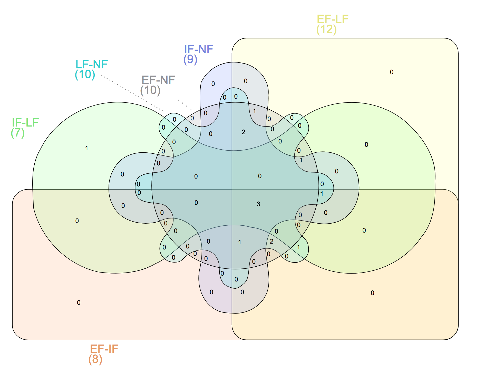

## [genes.txt](genes.txt)

A file that lists the gene IDs of genes that occur in one or more contrasts, and the
number of contrasts in which they occur. Produced as follows:

```shell
CONTRASTS=`ls /home/ubuntu/data/BSA/contrasts`

# create one big table
for C in $CONTRASTS; do 
   genes_in_qtl_regions.pl -c $C >> genes.tsv
done

# collapse to file with counts
cut -f4 genes.tsv | sort | uniq -c | sort --reverse > genes.txt
```

## [snps.tsv](snps.tsv)

A table of SNPs. This table is generated by the following logic:

- given a gene ID lookup all the SNPs in the CDSs of that gene
- with a G' of at least 2.5
- and assess whether they are nonsynonymous

The columns in the table are as follows:

- gene ID
- chromosome
- start coordinate of CDS
- end coordinate of CDS
- codon phase
- strand
- snp location
- syn/nonsyn
- reference allele
- comma-seprated list of alternative allele(s), usually only a single SNP, though
- whether the reference SNP matches the sequence at the location in the genome (so, should always be '=')
- comma-separated list of contrasts in which the allele occurs

This table is produced thusly:

```shell
sed -e 's/      . //' genes.txt | snps_in_cds.pl > snps.tsv
```

From this file, lists of UniProtKB identifiers (used for 
[GO enrichment tests](http://bioinfo.cau.edu.cn/agriGO)) are generated thusly:

```shell
for C in $CONTRASTS; do
   # 1. only get the SNPs associated with the focal contrast $C
   # 2. only get the nonsynonymous SNPs
   # 3. retain the column with transcript IDs (first column)
   # 4. sort | uniq => retain distinct IDs
   # 5. lookup the UniProtKB ids and go terms via biomart
   # 6. retain the column with UniProtKB ids (second column)
   # 7. sort | uniq => retain distinct IDs
   # 8. filter out the header and write to file 
   grep $C snps.tsv | grep nonsyn | cut -f1 | sort | uniq | biomart.pl | cut -f2 | sort | uniq | grep -v UniProtKB > ${C}/uniprot.txt
done
```

> Now go into one of the subtended folders and read the readme therein for the next steps

## Intersection among contrasts

Using the web application here: http://bioinformatics.psb.ugent.be/webtools/Venn/

And the third column (i.e. the GO term name) in the `*/enriched_GO_0003006.tsv`, the
following Venn diagram was produced:



| Names | total | elements |
|-------|-------|----------|
| EF-IF EF-LF EF-NF IF-LF IF-NF LF-NF | 3 | floral organ morphogenesis, [floral organ formation](http://www.informatics.jax.org/vocab/gene_ontology/GO:0048449), seed maturation |
| EF-IF EF-LF EF-NF IF-NF LF-NF | 1 | vegetative to reproductive phase transition of meristem |
| EF-IF EF-LF IF-LF IF-NF LF-NF | 1 | seed dormancy |
| EF-IF EF-LF EF-NF LF-NF | 2 | flower calyx development, sepal development |
| EF-IF EF-LF IF-LF LF-NF | 1 | petal morphogenesis |
| EF-LF EF-NF IF-LF IF-NF | 1 | floral organ development |
| EF-LF EF-NF IF-NF LF-NF | 2 | corolla development, petal development |
| EF-LF EF-NF IF-NF | 1 | floral whorl development |
| IF-LF | 1 | flower morphogenesis |
