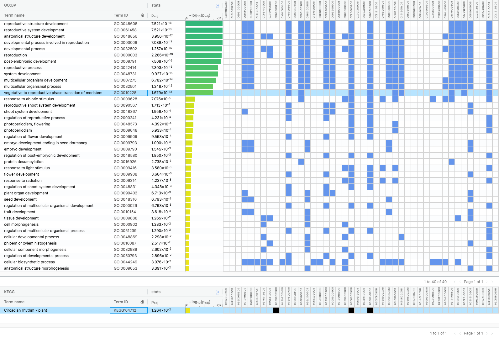
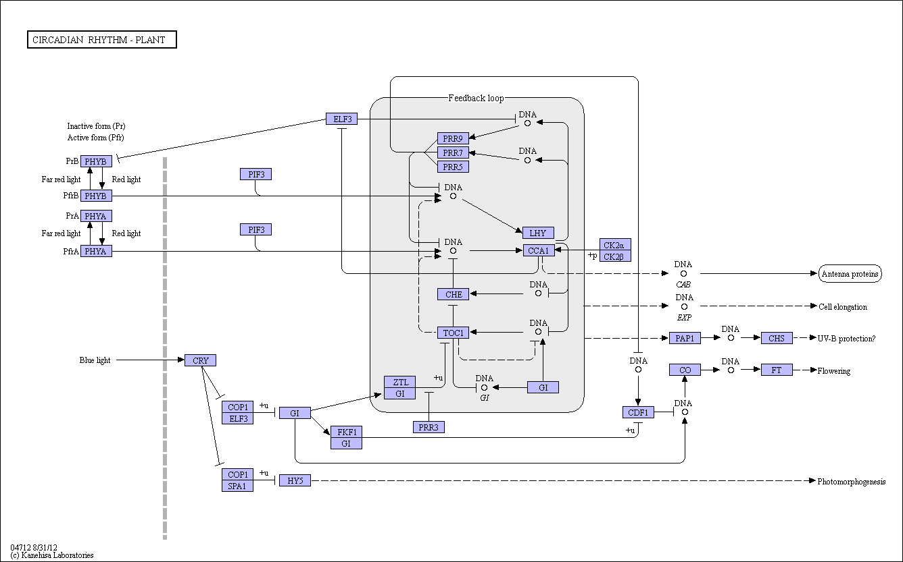

The folders below this one contain the consensus sequences for the CDSs of interest as identified in 
[intersection.tsv](intersection.tsv). Since the bulks consist of F1 offspring from a cross between the (putatively) 
homozygous parent TO1000 and Jersey Kale, any variants with respect to the reference (i.e. TO1000) can have an allele 
frequency of at most 50% if the Kale is homozygous for the alternative, or 25% if it's heterozygous.

The data have been processed with the following steps:

1. [create codon alignments](README_alignments.md)
2. [gProfiler analysis](https://biit.cs.ut.ee/gplink/l/5AaY0UNkTs) using the [`Gene stable ID`](mart_export_vegetative_to_reproductive_phase_transition_of_meristem.tsv) for 
[vegetative to reproductive phase transition of meristem](http://www.informatics.jax.org/vocab/gene_ontology/GO:0010228).

gProfiler returned the following hits:

Note the bottom row, with the KEGG hit, which is for [Cyrcadian rhythm - plant](https://www.genome.jp/kegg-bin/show_pathway?ko04712)

Note also the three loci that contributed to this pathway being overrepresented:

1. [Bo6g099320](Bo6g099320/combined-aligned.fasta), which is **FT**, flowering time
2. [Bo6g120900](Bo6g120900/combined-aligned.fasta)
3. [Bo4g006930](Bo4g006930/combined-aligned.fasta)

