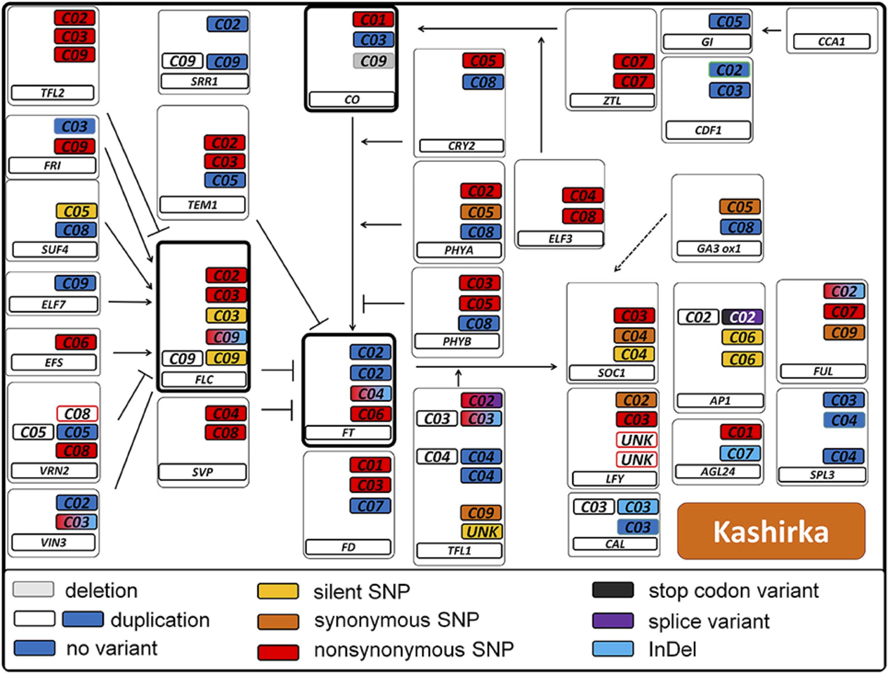

Targeted flowering genes
========================

The results in this folder are subsequent to a meeting at Naturalis on October 19th, 2018.
At this meeting, Eric Schranz introduced us to [a paper](https://dx.doi.org/10.3389%2Ffpls.2017.01742) 
where SNPs involved in flowering pathways had been investigated for various Brassica, and also 
suggested some specific genes to look at in greater detail. Here now the results of our investigation 
of these suggestions.

Replicating some of the paper's results
---------------------------------------
Figure 6 of the paper shows pathway variation in the _Brassica oleracea_ genotype Kashirka:

Especially the genes that are more central (and with greater connectivity) in the pathway are of
interest, but the original author was kind of enough to share the [entire list](oleracea_flowering_time_genes_frontiers.tsv),
including the mapping between gene names and the gene (copy) identifiers used in brassicology.

Using [this script](../../script/assess_input_genes.pl) and the list, we then reproduced a substantial
part of the results, [here](flower_time_genes.tsv). The columns of the resulting table should be
interpreted as follows:

- `coverage` is the average coverage along the entirety of the gene's locus for the mapped genome of
  the Jersey Kale individual, as computed using GATK's `DepthOfCoverage` command. This information
  is relevant because it provides an indication whether the copy may have been deleted. Our results
  conform with those in the paper: coverage is lowest for the CO copy on chromosome 9 (Bo9g163730),
  which is the one deletion in the Kashirka cultivar. Apparently the deletion is homologous across
  these two cultivars.
- `silent` SNPs are those which occur within the coordinates of the gene's entire locus, but outside
  of any exons, i.e. they are inside introns, or 3' or 5' untranslated regions (UTRs). In the figure
  the colour scheme of the SNPs escalates from silent < synonymous < nonsynomous (i.e. a gene copy
  that is red may also have synonymous or silent SNPs).
- `stop_codon` is interpreted here as whether any SNPs occur in the stop codon at all. Whether there
  are better ways to do this has not been investigated as it appears to be an issue that is probably
  peripheral to the whole system.
- `indels` where identified on the basis of whether the reference allele and the alternative allele
  differ in length.

The SNPs that were analyzed here were those from all bulk segregant analyses filtered by G'>2.5. In
other words, these SNPs are significant, with good coverage, and segregate between phenotyped groups.
The interesting result here is that there are such SNPs, that are additionally non-synonymous, for FT.
We can thus make a reasonable case that these would indeed have been implicated in bringing about the
different phenotypes.

Eric's favourite genes
----------------------

In addition, Eric provided four specific genes he recommended for further investigation:

| Gene name | Bo* number(s) | UniProtKB ID | enrichment results | SNPs | Notes |
|------------|-------------|---------------|-------------------|-------|-------|
| FT (chr6) | Bo6g099320 | A0A0D3CY76 | [enrichment results](https://github.com/naturalis/brassica-snps/search?q=A0A0D3CY76&unscoped_q=A0A0D3CY76) | [snps](https://github.com/naturalis/brassica-snps/blob/master/results/targeted/flower_time_genes.tsv#L36) | this gene fell under the term `vegetative to reproductive phase transition of meristem` |
| FLC (chr3) | Bo3g005470, Bo3g024250 | A0A0D3B0G2, A0A0D3B446 | NA | [none](https://github.com/naturalis/brassica-snps/blob/master/results/targeted/flower_time_genes.tsv#L23), [none](https://github.com/naturalis/brassica-snps/blob/master/results/targeted/flower_time_genes.tsv#L25) |
| CO (chr1,2,3,9) | Bo1g157390, Bo2g012810, Bo3g055600, Bo9g163720 | A0A0D3AG15, A0A0D3AJ98, A0A0D3B9E4, A0A0D3EF72 | NA, NA, [negative](https://github.com/naturalis/brassica-snps/search?q=A0A0D3B9E4&unscoped_q=A0A0D3B9E4), [negative](https://github.com/naturalis/brassica-snps/search?q=A0A0D3EF72&unscoped_q=A0A0D3EF72) | [none](https://github.com/naturalis/brassica-snps/blob/master/results/targeted/flower_time_genes.tsv#L8), [none](https://github.com/naturalis/brassica-snps/blob/master/results/targeted/flower_time_genes.tsv#L11), [snps](https://github.com/naturalis/brassica-snps/blob/master/results/targeted/flower_time_genes.tsv#L9), [snps](https://github.com/naturalis/brassica-snps/blob/master/results/targeted/flower_time_genes.tsv#L12) | this marker did not contribute to the enrichment of any GO terms |
| EFS (chr6) | Bo6g121240 | A0A0D3D1C9 | NA | [snps](https://github.com/naturalis/brassica-snps/blob/master/results/targeted/flower_time_genes.tsv#L15) |

What is notable here is three out of four indeed had significant, non-synomous, segregating SNPs:
FT (chr6), CO (chr3) / CO-like (chr9), EFS (chr6). Two of the four were also selected for GO
enrichment tests. Out of these, FT contributed to the term `vegetative to reproductive phase transition of meristem`.
Conversely, this term was enriched in five out of six contrasts (EF-IF, EF-LF, EF-NF, IF-NF, LF-NF).
As further work it would be a reasonable idea to evaluate the other genes annotated with this term,
along similar lines as was done for `floral organ formation`:

- A0A0D3AYT3
- A0A0D3AZ96
- A0A0D3B1Y7
- A0A0D3B843
- A0A0D3B8J1
- A0A0D3B8J1
- A0A0D3BIE0
- A0A0D3BJ86
- A0A0D3BJA1
- A0A0D3BNQ2
- A0A0D3BQ36
- A0A0D3BQ56
- A0A0D3C2D8
- A0A0D3C2D8
- A0A0D3C936
- A0A0D3C9Y2
- A0A0D3CUM3
- A0A0D3CVJ4
- A0A0D3CWM0
- A0A0D3CWY7
- A0A0D3CWY7
- A0A0D3CX00
- A0A0D3CXV0
- A0A0D3CY76
- A0A0D3D162
- A0A0D3D184
- A0A0D3D195
- A0A0D3D1D7
- A0A0D3D919
- A0A0D3DBD2
- A0A0D3DBR3
- A0A0D3DBR3
- A0A0D3DC48
- A0A0D3DD47
- A0A0D3DDB7
- A0A0D3DEB2
- A0A0D3DPN8
- A0A0D3E4D4
- A0A0D3E4Z6
- A0A0D3E5C0
- A0A0D3E5D2
- A0A0D3EDU2
- A0A0D3EEB4
- A0A0D3EEX9
- A0A0D3EHL2
- A0A0D3EHR1
- A0A0D3EHY9
- A0A0D3EI31